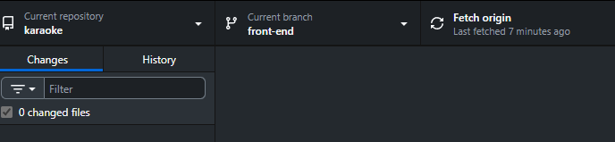

# Karaoke Booking (Next.js)

แอปพลิเคชันจองห้องคาราโอเกะสำหรับลูกค้าและผู้ดูแลระบบ สร้างด้วย Next.js (App Router) เชื่อมต่อ MongoDB มีระบบล็อกอิน/สมัครสมาชิก การจองห้อง โปรโมชั่น ชำระเงิน (PromptPay/Stripe) และแดชบอร์ดผู้ดูแล

## คุณสมบัติหลัก
- หน้าล็อกอิน/สมัครสมาชิก/รีเซ็ตรหัสผ่าน
- จองห้อง เลือกวัน ช่วงเวลา จำนวนคน ใส่โค้ดโปรโมชัน
- ระบบชำระเงิน: PromptPay ผ่าน Stripe + Webhook อัปเดตสถานะ
- โปรไฟล์ผู้ใช้ แก้ไขรหัสผ่าน
- หน้าผู้ดูแล: ห้อง โปรโมชั่น สรุปข้อมูล (Chart.js)

## เทคโนโลยี
- Next.js 15 (App Router), React 19
- NextAuth (Credentials) สำหรับ Authentication
- MongoDB + Mongoose
- Tailwind CSS v4
- Stripe (PromptPay), Resend (ส่งอีเมล)

## โครงสร้างโฟลเดอร์สำคัญ
- `src/app` — เพจและ API routes
  - เพจ: `src/app/page.jsx`, `src/app/login/page.jsx`, `src/app/register/page.jsx`, `src/app/booking/page.jsx`, `src/app/admin/page.jsx` เป็นต้น
  - API: `src/app/api/**/route.js` เช่น `auth`, `bookings`, `rooms`, `promotions`, `stripe/webhook`
- `models` — สคีมาของ MongoDB (`user.js`, `room.js`, `promotion.js`, `booking.js`)
- `lib` — ยูทิลิตี (`mongodb.js`, `mailer.js`, `password.js`)
- `scripts` — สคริปต์ (`seed.js` สำหรับใส่ข้อมูลตัวอย่าง)

## เตรียมสภาพแวดล้อม
- แนะนำ Node.js >= 18.18 (LTS)
- ติดตั้งแพ็กเกจด้วย `npm i`
- ตั้งค่าตัวแปรแวดล้อมในไฟล์ `/.env.local` (ไม่ควรคอมมิตขึ้น Git)

ไฟล์ .env ใน discord

## คำสั่ง
- `npm run dev` — รันโหมดพัฒนา (http://localhost:3000)
- `npm run build` — สร้าง production build
- `npm start` — รัน production build
- `npm run lint` / `npm run lint:fix` — เช็ก/แก้สไตล์โค้ด
- `npm run format` — จัดรูปแบบโค้ด

## การรันในเครื่อง (Local)
1) ติดตั้งแพ็กเกจ: `npm i`
2) ใส่ `.env`
3) รัน dev: `npm run dev`
4) เปิดเบราว์เซอร์ไปที่ `http://localhost:3000`

## บัญชีเทส
- admin
    email `admin@example.com`
    password `123456`

## การ logIn (NextAuth)
- การตั้งค่าอยู่ที่ `src/app/api/auth/[...nextauth]/route.js`
- ใช้ Credentials Provider (อีเมล/รหัสผ่าน) กับ MongoDB
- ฝั่งเซิร์ฟเวอร์ใช้ `getServerSession` เพื่อตรวจสอบสิทธิ์ API ต่าง ๆ

## การชำระเงิน (Stripe PromptPay)
- เริ่มธุรกรรมผ่าน `POST /api/payments/promptpay`
- รับ Webhook ที่ `POST /api/stripe/webhook` เพื่ออัปเดตสถานะเป็น `PAID`
- ทดสอบในเครื่อง:
  1) ติดตั้ง Stripe CLI
  2) รัน: `stripe listen --forward-to localhost:3000/api/stripe/webhook`
  3) นำค่า `webhook signing secret` ไปใส่ใน `STRIPE_WEBHOOK_SECRET`

## วิธีเขียนโค้ดต่อ
- เพจใหม่: สร้างโฟลเดอร์ภายใต้ `src/app/<route>/page.jsx`
- คอมโพเนนต์ UI: `src/app/components/*`
- API ใหม่: เพิ่มใน `src/app/api/<name>/route.js`
- โมเดล/ฐานข้อมูล: สร้างหรือแก้ที่ `models/*.js` เชื่อมผ่าน `lib/mongodb.js`
- Tailwind ใน `src/app/globals.css` 

## การใช้งาน Git และ GitHub
1) เริ่มต้น Git ในเครื่อง (ถ้ายังไม่ได้เริ่ม):
```
git init
git add .
git commit -m "chore: bootstrap project"
```
2) สร้างรีโปบน GitHub แล้วเชื่อมรีโมต:
```
git remote add origin https://github.com/AchiZ48/karaoke.git
git branch -M main
git push -u origin main
```
3) เวิร์กโฟลว์แนะนำ (Branching):
- สร้างสาขาคุณลักษณะ: `git checkout -b feature/<รายละเอียดฟีเจอร์>`
- คอมมิต(ส่งบันทึกโค้ดแต่ยังไม่อัพโหลดอยู่แค่บนเครื่องตัวเอง): วืธีใช้ `git commit -m "รายละเอียดสิ่งที่ทำ เช่น feat: add booking validation"`

- กด Pull Request บน GitHub เพื่อรวมไฟล์
